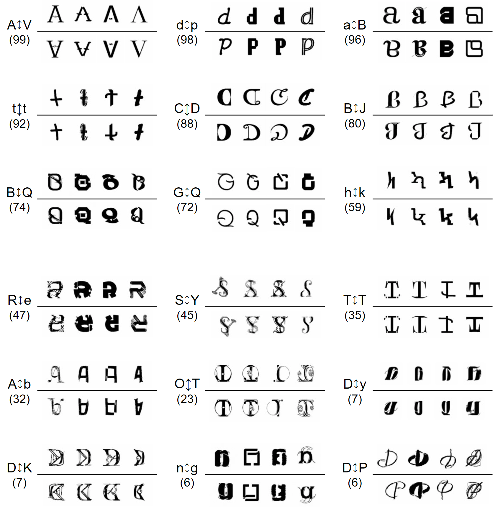

# Ambifusion
This is an official repogitory for the paper "Ambigram Generation by a Diffusion model". This paper is accepted at ICDAR 2023. 
- paper link: [arXiv](https://arxiv.org/abs/2306.12049)
  
  
## About the Paper
tl;dr
- We propose an ambigram generation method by a diffusion model. 
- You can generate various ambigram images by specifying a pair of letter classes.
- We propose `ambigramability`, an objective measure of how easy it is to generate ambigrams for each letter pair. 

#### Abstract
Ambigrams are graphical letter designs that can be read not only from the original direction but also from a rotated direction (especially with 180 degrees). Designing ambigrams is difficult even for human experts because keeping their dual readability from both directions is often difficult. This paper proposes an ambigram generation model.  As its generation module, we use a diffusion model, which has recently been used to generate high-quality photographic images. By specifying a pair of letter classes, such as 'A' and 'B', the proposed model generates various ambigram images which can be read as 'A' from the original direction and 'B' from a direction rotated 180 degrees. Quantitative and qualitative analyses of experimental results show that the proposed model can generate high-quality and diverse ambigrams. In addition, we define ambigramability, an objective measure of how easy it is to generate ambigrams for each letter pair. For example, the pair of 'A' and 'V' shows a high ambigramability (that is, it is easy to generate their ambigrams), and the pair of 'D' and 'K' shows a lower ambigramability. The ambigramability gives various hints of the ambigram generation not only for computers but also for human experts.

#### Examples
Our proposed method generates ambigrams like following examples. 


The parenthesized number is the ambigramability score (↑) of the letter pair. The upper three rows are rather easy class pairs (with higher ambigramability scores), and the lower three are not.
  
  
## Experiment environment setup
We tested all codes in `Python: 3.8.10`.
You can download external libraries with `pip` as following.
```
pip install torch==1.11.0+cu113 torchvision==0.12.0+cu113 torchaudio==0.11.0 --extra-index-url https://download.pytorch.org/whl/cu113
pip install -r requirements.txt
```
You can also download pre-trained weights.
Replace all pseud-weights file `weight_name.txt` with downloaded real-weights file.

- weights link: [GoogleDrive](https://drive.google.com/drive/folders/1BVrOVXYjFJMdqy9YkcRUjEIA_7O691Wo?usp=sharing)
  
  
## Demo
## Gradio demo is available.
1. Start gradio web app as following.
```
python demo.py
```
2. Access `127.0.0.1:11111` with your web browser.

#### Make ambigrams
1. Set `TestConfigs` in `ambigram_random_sample.py`.
2. Run the sampling code as following.
```
python ambigram_random_sample.py
```

#### Check ambigramability
1. Set `TestConfigs` in `calc_ambigramability.py`.
2. Run the calculation code as following.
```
python calc_ambigramability.py
```
  
  
## Customize
#### Model training.
1. Set `TrainConfigs` in `configs/trainargs.py`. If you want, you can change `DA_ambigram_configs.yaml` (The details are mentioned at Sec. 3.2 in the paper).
2. Run the training code as following.
```
## Run on single gpu
python ambigram_train.py

## Run on multiple gpus
mpiexec -n [NUM_GPUs] python ambigram_train.py
```
Note[1]: If you want to generate ambigrams by using `classifier-free guidance`, you have to train both conditional-model and unconditional-model separately.
  
  
## Paper information
```
@article{shirakawa2023ambigram,
  title={Ambigram Generation by A Diffusion Model},
  author={Shirakawa, Takahiro and Uchida, Seiichi},
  booktitle={2023 17th international conference on document analysis and recognition (ICDAR)},
  year={2023}
}
```


